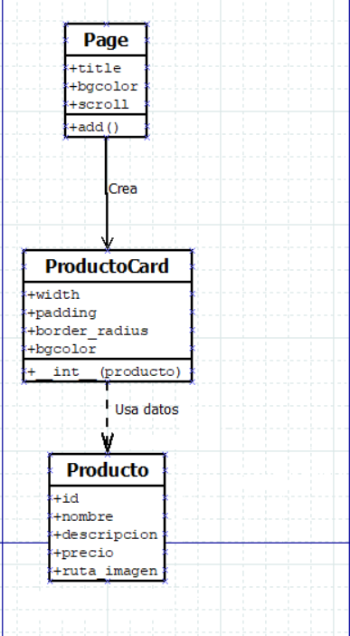
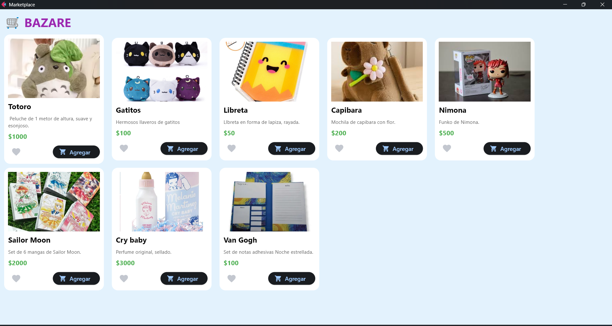
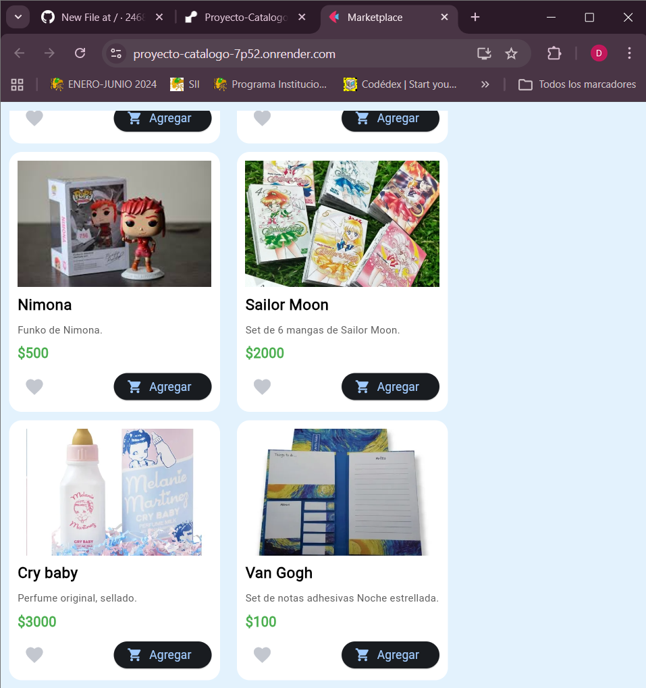

# Catálogo
Diseñar y crear sus propios componentes visuales (controles de usuario) para construir una interfaz gráfica profesional, aplicando conceptos de empaquetado y reutilización de código.
## Programa
* Importamos la biblioteca Flet, permitiendo la creación de la interfaz gráfica ysu posterior ejecución a sitio web.

```Python
import flet as ft
  ```

* Creamos un arreglo para definir la información especifica de cada producto como:
  * id.
  * nombre.
  * descripción.
  * precio.
  * ruta_imagen.
    
  Estas se utilizarán para generar las tarjetas del catálogo.
```Python
productos = [
    {"id": 1, "nombre": "Totoro", "descripcion": " Peluche de 1 metor de altura, suave y esonjoso.", "precio": 1000, "ruta_imagen": "1.avif"},
    {"id": 2, "nombre": "Gatitos", "descripcion": "Hermosos llaveros de gatitos", "precio": 100, "ruta_imagen": "2.webp"},
    {"id": 3, "nombre": "Libreta", "descripcion": "LIbreta en forma de lapiza, rayada.", "precio": 50, "ruta_imagen": "3.webp"},
    {"id": 4, "nombre": "Capibara", "descripcion":"Mochila de capibara con flor.", "precio": 200, "ruta_imagen": "4.jpg"},
    {"id": 5, "nombre": "Nimona", "descripcion": "Funko de Nimona.", "precio": 500, "ruta_imagen": "5.jpg"},
    {"id": 6, "nombre": "Sailor Moon", "descripcion": "Set de 6 mangas de Sailor Moon.", "precio": 2000, "ruta_imagen": "6.webp"},
    {"id": 7, "nombre": "Cry baby", "descripcion": "Perfume original, sellado.", "precio": 3000, "ruta_imagen": "7.webp"},
    {"id": 8, "nombre": "Van Gogh", "descripcion": "Set de notas adhesivas Noche estrellada.", "precio": 100, "ruta_imagen": "8.webp"},
]
```
* Creamos la clase *ProductoCard* que hereda a *Container* de Flet, es usada para guardar el texto, imágenes y botones de las tarjetas del catálogo.
```Python
class ProductoCard(ft.Container):
  ```

* Definimos un constructor que recibira al parámetro *producto*, este contendra los datos del producto a mostrar. Cada tarjeta creada contendra un roducto diferente.
```Python
 def __init__(self, producto):
  ```

* Esta línea es necesaria para que la clase *ProductoCard* pueda heredar las características de la clase *Container*.
```Python
       super().__init__()
  ```
  
* Este fragmento define las características visuales de la tarjeta; su ancho, espacio interno, bordes redondeados y su color de fondo; para que tenga un diseño limpio y uniforme.
```Python
        self.width = 250
        self.padding = 10
        self.border_radius = 15
        self.bgcolor = ft.Colors.WHITE
  ```
* Indica que los siguientes elementos van dentro del contenedor, son organizados verticalmete con un espacio de 8 pixeles entre cada elemento.
```Python
        self.content = ft.Column(
            spacing=8,
            controls=[
  ```
* Creamos el componente *ft.Image* que muestra la ruta de donde se encuebtra la imagen, el tamaño que debe aquirir yfinalmete se ajusto al tamaño anteriro mente definido.
```Python
                ft.Image(
                    src=producto["ruta_imagen"],
                    width=230,
                    height=150,
                    fit="cover"
                ),
  ```
* Ahora creamos el componente *Text* para definir las caraterísticas del nombre del producto como:
    * Tamaño.
    * Color.
    * Fuente.
```Python
                ft.Text(
                    producto["nombre"],
                    size=18,
                    color=ft.Colors.BLACK,
                    weight="bold"
                ),
  ```
Esta estructura se utiliza para definir la descripción y el precio del producto, respetando sus características específicas. 

* *Row* define que lo siguinte se organizara horizontalmente dentro del contenedor, en este caso seran el boton con forma de corazón y el de agregar al carrito.
  * Por el momento, estos botones no realizan niguna acción.
```Python
                ft.Row(
                    alignment=ft.MainAxisAlignment.SPACE_BETWEEN,
                    controls=[
                        ft.IconButton(icon=ft.Icons.FAVORITE),
                        ft.ElevatedButton(
                            "Agregar",
                            icon=ft.Icons.SHOPPING_CART
                        )
  ```

* Funció principal que representa la página de la aplicación.
```Python
  def main(page: ft.Page):
  ```

* Este fragmento define el titulo de la página, su color y el scroll que nos permitira navegar por ella.
```Python
    page.title = "Marketplace"
    page.bgcolor = ft.Colors.BLUE_50
    page.scroll = "auto"
  ```

* Definimo el encabezado dentro de la página; el texto que contendra, su color, tamaño y la fuente.
```Python
    header = ft.Text(
        "🛒 BAZARE",
        color=ft.Colors.PURPLE,
        size=30,
        weight="bold"
        
    )
  ```

* Aquí ocurre lo importante, despues de difinir todas las carateríticas necesarias para la tarjetas, es hora de generar las necesarias segun la cantidad de productos.
  
  Para ello, usamos un ciclo for que se detendra una vez recorrada cada producto y, además,
  ordena las tarjetas segun el tamaño que el usuario defina de la página que las contiene.
```Python
    tarjetas = []

    for producto in productos:
        tarjetas.append(ProductoCard(producto))

    catalogo = ft.Row(
        controls=tarjetas,
        wrap=True,
        spacing=20
    )
  ```

* Añadimos el título y el catálogo a la página.
```Python
    page.add(
        header,
        catalogo
    )

  ```

* Finalmente ejecutamos la aplicación.
```Python
ft.app(
    target=main,
    assets_dir="imagenes"
)
  ```

[Da click para ver el código completo](./main.py)

### Diagrama de clases


Representa la estructura del programa y la relación entre la clase principal de la aplicación y la clase personalizada que representa cada producto dentro del catálogo desarrollado con Flet.

En el sistema se pueden identifican tres elementos principales:

**1. Clase Principal de la Aplicación (Page / main)**

La aplicación inicia con la función *main(page: ft.Page)*, que recibe un objeto de tipo *Page*, erepresentando la ventana o página principal de la aplicación, esta utiliza la clase *ProductoCard* para construir la interfaz del catálogo.

Esta clase se encarga de:

* Configurar propiedades de la página como el título, color de fondo y scroll.
* Crear el encabezado de la interfaz.
* Recorrer el arreglo de productos.
* Crear una instancia de ProductoCard para cada producto.
* Mostrar todas las tarjetas en un contenedor tipo Row.

**2. Clase ProductoCard**

Esta es un componente personalizado que representa visualmente un producto dentro del catálogo.
Hereda de la clase *Container* las siguintes propiedades de diseño:
* ancho **(width)**.
* relleno interno **(padding)**.
* color de fondo **(bgcolor)**.
* bordes redondeados **(border_radius)**.
* contenido interno **(content)**.

Así podemos organizar la información del producto mediante una estructura de tipo Column, que contiene:
* Una imagen del producto.
* Nombre.
* Descripción.
* Precio
* Barra de acciones con botones.

Cada vez que se crea una instancia de ProductoCard, se le pasa un objeto producto que contiene la información necesaria para llenar la tarjeta.

**3. Estructura Producto**

Los productos se representan mediante un arreglo llamado *productos*.

Cada producto contiene los siguientes atributos:
* Id.
* Nombre.
* Descripcion.
* Precio.
* ruta_imagen.

Estos datos son utilizados por la clase *ProductoCard* para mostrar la información correspondiente en cada tarjeta del catálogo.

### Herencia
Para crear el componente personalizado se utilizó herencia a partir de una clase base de Flet.
  ```Python
class ProductoCard(ft.Container):
  ```
La clase *ProductoCard* hereda la clase *Container* de Flet.
Que nospermite usar las propiedades como:
* ancho (width).
* relleno interno (padding).
* color de fondo (bgcolor).
* bordes redondeados (border_radius).
* contenido interno (content).
* una imagen (Image).
* textos (Text).
* Botones (Row, IconButton, ElevatedButton).

Nos permite construir un componente visual complejo reutilizando la estructura del framework, para no repetir el código,
### Gestión de recursos
Para mostrar imágenes en la aplicación se utilizó un directorio de recursos locales. Creamos una carpeta llamada *imagenes*, dentro de ella se guardaron todas las imagenes utilizadas para el proyecto.
Para ingresar a ella usamos *assets_dir:*.
  ```Python
  ft.app(
    target=main,
    assets_dir="imagenes"
)
  ```
Que le indica al framework que todas las imágenes deben buscarse dentro de la carpeta imagenes.

Posteriormente, cada producto referencia su imagen mediante la propiedad:
  ```Python
 src=producto["ruta_imagen"],
)
  ```
Así, flet carga automáticamente las imágenes desde el directorio de recursos configurado.

### Resultado

## Sitio Web
Ahora que hemos diseñado nuestro código, lo convertiremos en una página web, para ello necesitamos:
* Una cuenta en GIthub.
  
  https://github.com/
  
* Una cuenta en Render.
  
  https://render.com/
  
* Tener instalado Gitbash en tu equipo.

1️⃣**Estructura**

Crea una carpeta que contendra:
* main.py
* Carpeta de imagenes para el catálogo.
* requirements.txt

El archivo de texto *requirements*, debe contener la palabra **flet**.

2️⃣**Gitbash**

Abre Gitbash dentro del entorno virtuarl flet, escribe lo siguinete en Gitbash para activar el entorno flet.
  ```bash
  source .venv/Scripts/activate
  ```
Ahora, ingresa a la carpeta de tu proyecto y configura tu nombre y correo, estos deben ser los mismo que en GitHub.
  ```bash
 git config --global user.name "Tu Nombre"
  ```
  ```bash
 git config --global user.email "tuemail@gmail.com"
  ```
Convierte tu carpeta en un repositorio con:
  ```bash
  git init
  ```
Agrega todos los archivos del proyecto.
  ```bash
  git add .
  ```
Crea tu primer *commit*, para especificar que cambios se hicieron en el proyecto.
  ```bash
  git commit -m "Primer commit "
  ```
  
3️⃣**Github**

Crea un nuevo repositorio, puedes poner el nombre que desees, pero es recomendable el nombre del proyecto que subiras, no crees un Readme, deja la configuración predeterminada de Github. 

4️⃣**Conección**

Una vez creado nuestro repositrio, volvemos a Gitbash e ingresamos:
 ```bash
  git remote add origin https://github.com/TU-USUARIO/nombree-repositorio.git
  ```
Para ligar el repositorio a Gitbash.

  ```bash
git branch -M main
git push -u origin main
  ```
Esto enviara tu proyeto a el repositorio de GitHub anteriormente seleccionado.

5️⃣**Crear la web en Render**

Creamos una nueva Web Service, la conectamos a nuestra cuenta de GitHub y seleccionamos el repositorio de nuestro proyecto.

En el área de **Build Command** escribe lo siguinete:
  ```bash
pip install -r requirements.txt
  ```
Y en **Start Command**
  ```bash
python main.py
  ```
Una vez específicado, damos click en el boton para inicializar el proceso.

Sí, todo sale bien te dara un link com el siguinete:

https://proyecto-catalogo-7p52.onrender.com

Esto quiere decir que tu catálogo ya es na página web.🥳
* Un punto importante es que al usar el sevicio gratuito de *Render*,la página puede tardar un poco en cargar.
### Resultado

